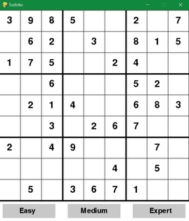

## Sudoku Solver

First project trying out GitHub

**1.** Creates random board by filling an empty board with backtracking

**2.** Randomily removes given amount of numbers from the board
    
    > "easy" | "medium | "expert"
    
**3.** Sudoku can be solved on the graphical user interface

**4.** ~~Click button to change sudoku difficulty~~ (not done yet)

### Requirements
The GUI is made with the pygame modul

`pip install pygame`
`python3 GUI.py`

GUI template from @techwithtim
